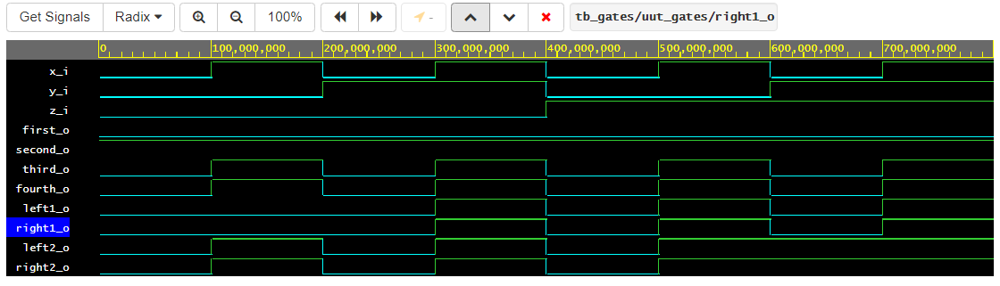

# Lab 01-gates

## My repository
[My git - Tomáš Kříčka, 223283](https://github.com/TomasKricka/Digital-electronics-1)


## De Morgan's laws
| **c** | **b** |**a** | **f(c,b,a)** |
| :-: | :-: | :-: | :-: |
| 0 | 0 | 0 | 1 |
| 0 | 0 | 1 | 1 |
| 0 | 1 | 0 | 0 |
| 0 | 1 | 1 | 0 |
| 1 | 0 | 0 | 0 |
| 1 | 0 | 1 | 1 |
| 1 | 1 | 0 | 0 |
| 1 | 1 | 1 | 0 |

### Waveforms


### VHDL code

```vhdl 
------------------------------------------------------------------------
--
-- Example of basic OR, AND, XOR gates.
-- Nexys A7-50T, Vivado v2020.1, EDA Playground
--
-- Copyright (c) 2019-2020 Tomas Fryza
-- Dept. of Radio Electronics, Brno University of Technology, Czechia
-- This work is licensed under the terms of the MIT license.
--
------------------------------------------------------------------------

library ieee;               -- Standard library
use ieee.std_logic_1164.all;-- Package for data types and logic operations

------------------------------------------------------------------------
-- Entity declaration for basic gates
------------------------------------------------------------------------
entity gates is
    port(
        a_i    : in  std_logic;         -- Data input
        b_i    : in  std_logic;         -- Data input
        c_i	   : in  std_logic;
        f_o	   : out std_logic;
        fnand_o : out std_logic;
        fnor_o  : out std_logic
        --for_o  : out std_logic;         -- OR output function
        --fand_o : out std_logic;         -- AND output function
        --fxor_o : out std_logic          -- XOR output function
    );
end entity gates;

------------------------------------------------------------------------
-- Architecture body for basic gates
------------------------------------------------------------------------
architecture dataflow of gates is
begin
	f_o <= ((not b_i) and a_i) or ((not c_i) and (not b_i));
    fnand_o <= ((b_i nand b_i) nand a_i) nand ((c_i nand c_i) nand (b_i nand b_i));
    fnor_o <= (((a_i nor a_i) nor b_i) nor (b_i nor c_i)) nor (((a_i nor a_i) nor b_i) nor (b_i nor c_i));
    
    --for_o  <= a_i or b_i;
    --fand_o <= a_i and b_i;
    --fxor_o <= a_i xor b_i;

end architecture dataflow;

```
### Link
[Playgound EDA](https://www.edaplayground.com/x/j_mJ)

<br>
<br>

## Distributive laws

### Waveforms



### VHDL code

```vhdl 
-- Code your design here
library IEEE;
use IEEE.std_logic_1164.all;

------------------------------------------------------------------------
-- Entity declaration for basic gates
------------------------------------------------------------------------

entity gates is
	port (
    	x_i			: in std_logic;		-- input data
        y_i			: in std_logic;
        z_i			: in std_logic;
        
        first_o		: out std_logic;
        second_o	: out std_logic;
        third_o		: out std_logic;
        fourth_o	: out std_logic;
        
        
        left1_o		: out std_logic;
        right1_o	: out std_logic;
        left2_o		: out std_logic;
        right2_o	: out std_logic      
    
    );
end entity gates;

------------------------------------------------------------------------
-- Architecture body for basic gates
------------------------------------------------------------------------

architecture dataflow of gates is
begin
	first_o <= x_i and not(x_i);
    second_o <= x_i or not(x_i);
    third_o <= x_i or x_i or x_i;
    fourth_o <= x_i and x_i and x_i;
    
    left1_o <= (x_i and y_i) or (x_i and z_i);
    right1_o <= x_i and (y_i or z_i);
    left2_o <= (x_i or y_i) and (x_i or z_i);
    right2_o <= x_i or (y_i and z_i);
    
end architecture dataflow;
```

### Link
[Playgound EDA](https://www.edaplayground.com/x/urFf)