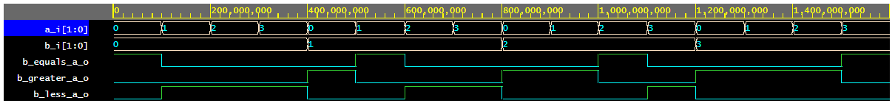

# Lab 02 - logic

## My repository
[My git - Tomáš Kříčka, 223283](https://github.com/TomasKricka/Digital-electronics-1)


## Table
| **Dec. equivalent** | **B[1:0]** | **A[1:0]** | **B is greater than A** | **B equals A** | **B is less than A** |
| :-: | :-: | :-: | :-: | :-: | :-: |
|  | b1, b0 | a1, a0 |  |  |  |
| 0 | 0 0 | 0 0 | 0 | 1 | 0 |
| 1 | 0 0 | 0 1 | 0 | 0 | 1 |
| 2 | 0 0 | 1 0 | 0 | 0 | 1 |
| 3 | 0 0 | 1 1 | 0 | 0 | 1 |
| 4 | 0 1 | 0 0 | 1 | 0 | 0 |
| 5 | 0 1 | 0 1 | 0 | 1 | 0 |
| 6 | 0 1 | 1 0 | 0 | 0 | 1 |
| 7 | 0 1 | 1 1 | 0 | 0 | 1 |
| 8 | 1 0 | 0 0 | 1 | 0 | 0 |
| 9 | 1 0 | 0 1 | 1 | 0 | 0 |
| 10 | 1 0 | 1 0 | 0 | 1 | 0 |
| 11 | 1 0 | 1 1 | 0 | 0 | 1 |
| 12 | 1 1 | 0 0 | 1 | 0 | 0 |
| 13 | 1 1 | 0 1 | 1 | 0 | 0 |
| 14 | 1 1 | 1 0 | 1 | 0 | 0 |
| 15 | 1 1 | 1 1 | 0 | 1 | 0 |
<br>
<br>

_equals_SoP = !a!b!c!d + !dc!ba + d!cb!a + dcba_

_less_PoS = (d+c+b+a) (d+!c+b+a) (d+!c+b+!a) (!d+c+b+a) (!d+c+b+!a) (!d+c+!b+a) (!d+!c+b+a) (!d+!c+b+!a) (!d+!c+!b+a) (!d+!c+!b+!a)_

<br>
<br>

## Karnaugh maps of function
<br>

### Greater-SOP


_greater_SoP = d!b!a + c!b!a + dc!a + d!ba_

<br>

### Equals-SOP


_equals_SoP = !d!c!b!a + d!cb!a + dcba + !dc!ba_

<br>

### Less-POS


_less_PoS = (b + a) * (!d + !c) * (!d + b) * (!c + b) * (!d + a)_

<br>

## 2-bit comparator


<br>

### Link
[EDA Playground 2-bit](https://www.edaplayground.com/x/jZW5)

<br>
<br>
<br>

## 4-bit binary comparator

### Code design

```vhdl
library ieee;
use ieee.std_logic_1164.all;

------------------------------------------------------------------------
-- Entity declaration for 4-bit binary comparator
------------------------------------------------------------------------
entity comparator_4bit is
    port(
        a_i          	: in  std_logic_vector(4 - 1 downto 0);
		b_i				: in  std_logic_vector(4 - 1 downto 0);

        -- COMPLETE ENTITY DECLARATION
		B_greater_A_o	: out std_logic;
		B_equals_A_o	: out std_logic;
        B_less_A_o    	: out std_logic       -- B is less than A
    );
end entity comparator_4bit;

------------------------------------------------------------------------
-- Architecture body for 4-bit binary comparator
------------------------------------------------------------------------
architecture Behavioral of comparator_4bit is
begin
	B_greater_A_o	<= '1' when (b_i > a_i) else '0';
    B_equals_A_o 	<= '1' when (b_i = a_i) else '0';
    B_less_A_o   	<= '1' when (b_i < a_i) else '0'; 

    -- WRITE "GREATER" AND "EQUALS" ASSIGNMENTS HERE


end architecture Behavioral;
```
<br>

### Code testbench

```vhdl
library ieee;
use ieee.std_logic_1164.all;

------------------------------------------------------------------------
-- Entity declaration for testbench
------------------------------------------------------------------------
entity tb_comparator_4bit is
    -- Entity of testbench is always empty
end entity tb_comparator_4bit;

------------------------------------------------------------------------
-- Architecture body for testbench
------------------------------------------------------------------------
architecture testbench of tb_comparator_4bit is

    -- Local signals
    signal s_a       : std_logic_vector(4 - 1 downto 0);
    signal s_b       : std_logic_vector(4 - 1 downto 0);
    signal s_B_greater_A : std_logic;
    signal s_B_equals_A  : std_logic;
    signal s_B_less_A    : std_logic;

begin
    -- Connecting testbench signals with comparator_2bit entity (Unit Under Test)
    uut_comparator_4bit : entity work.comparator_4bit
        port map(
            a_i           => s_a,
            b_i           => s_b,
            B_greater_A_o => s_B_greater_A,
            B_equals_A_o  => s_B_equals_A,
            B_less_A_o    => s_B_less_A
        );

    --------------------------------------------------------------------
    -- Data generation process
    --------------------------------------------------------------------
    p_stimulus : process
    begin
        -- Report a note at the begining of stimulus process
        report "Stimulus process started" severity note;


        -- First test values
        s_b <= "0000"; s_a <= "0000"; wait for 100 ns;
        -- Expected output
        assert ((s_B_greater_A = '0') and (s_B_equals_A = '1') and (s_B_less_A = '0'))
        -- If false, then report an error
        report "Test failed for input combination: 0000, 0000" severity error;
        
        s_b <= "0100"; s_a <= "0001"; wait for 100 ns;
        assert ((s_B_greater_A = '1') and (s_B_equals_A = '0') and (s_B_less_A = '0'))
        report "Test failed for input combination: 0100, 0001" severity error;
        
        s_b <= "0000"; s_a <= "1010"; wait for 100 ns;
        assert ((s_B_greater_A = '1') and (s_B_equals_A = '0') and (s_B_less_A = '0'))
        report "Test failed for input combination: 0000, 1010" severity error;
        
        s_b <= "0011"; s_a <= "0101"; wait for 100 ns;
        assert ((s_B_greater_A = '0') and (s_B_equals_A = '0') and (s_B_less_A = '1'))
        report "Test failed for input combination: 0011, 0101" severity error;
        
        s_b <= "0100"; s_a <= "0000"; wait for 100 ns;
        assert ((s_B_greater_A = '1') and (s_B_equals_A = '0') and (s_B_less_A = '0'))
        report "Test failed for input combination: 0100, 0000" severity error;
        
        s_b <= "0001"; s_a <= "0001"; wait for 100 ns;
        assert ((s_B_greater_A = '0') and (s_B_equals_A = '0') and (s_B_less_A = '1'))
        report "Test failed for input combination: 0001, 0001" severity error;
        
        s_b <= "1101"; s_a <= "0010"; wait for 100 ns;
        assert ((s_B_greater_A = '1') and (s_B_equals_A = '0') and (s_B_less_A = '0'))
        report "Test failed for input combination: 1101, 0010" severity error;
        
        s_b <= "0110"; s_a <= "1001"; wait for 100 ns;
        assert ((s_B_greater_A = '0') and (s_B_equals_A = '0') and (s_B_less_A = '1'))
        report "Test failed for input combination: 0110, 0110" severity error;
        
        s_b <= "0010"; s_a <= "0000"; wait for 100 ns;
        assert ((s_B_greater_A = '1') and (s_B_equals_A = '0') and (s_B_less_A = '0'))
        report "Test failed for input combination: 0010, 0000" severity error;
        
        s_b <= "1110"; s_a <= "0111"; wait for 100 ns;
        assert ((s_B_greater_A = '1') and (s_B_equals_A = '0') and (s_B_less_A = '0'))
        report "Test failed for input combination: 1110, 0111" severity error;
        
        s_b <= "1000"; s_a <= "1000"; wait for 100 ns;
        assert ((s_B_greater_A = '0') and (s_B_equals_A = '1') and (s_B_less_A = '0'))
        report "Test failed for input combination: 00, 00" severity error;
        
        
        
        -- WRITE OTHER TESTS HERE


        -- Report a note at the end of stimulus process
        report "Stimulus process finished" severity note;
        wait;
    end process p_stimulus;

end architecture testbench;
```

<br>

### Errors
```
analyze design.vhd
analyze testbench.vhd
elaborate tb_comparator_4bit
testbench.vhd:51:9:@0ms:(report note): Stimulus process started
testbench.vhd:66:9:@300ns:(assertion error): Test failed for input combination: 0000, 01010
testbench.vhd:78:9:@600ns:(assertion error): Test failed for input combination: 0001, 0001
testbench.vhd:107:9:@1100ns:(report note): Stimulus process finished
Finding VCD file...
```
<br>

### 4-bit comparator


<br>

### Link
[EDA Playground 4-bit](https://www.edaplayground.com/x/cbTV)