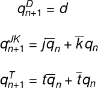

# 07-ffs

## My repository
[My git - Tomáš Kříčka, 223283](https://github.com/TomasKricka/Digital-electronics-1)

<br>

### Equations


<br>

### Thrut tables for D flip-flop, JK, T flip-flops

   | **clk** | **D** | **Qn** | **Q(n+1)** | **Comments** |
   | :-: | :-: | :-: | :-: | :-: |
   | ↑ | 0 | 0 | 0 | No change |
   | ↑ | 0 | 1 | 0 | No change |
   | ↑ | 1 | 0 | 1 | q(n+1)-d  |
   | ↑ | 1 | 1 | 1 |  |

<br>

### Thrut tables for JK flip-flop

   | **clk** | **J** | **K** | **Qn** | **Q(n+1)** | **Comments** |
   | :-:| :-: | :-: | :-: | :-: | :-- |
   | ↑ | 0 | 0 | 0 | 0 | No change1 |
   | ↑ | 0 | 0 | 1 | 1 | No change1 |
   | ↑ | 0 | 1 | 0 | 0 | Reset1 |
   | ↑ | 0 | 1 | 1 | 0 | Reset1 |
   | ↑ | 1 | 0 | 0 | 1 | Set1 |
   | ↑ | 1 | 0 | 1 | 1 | Set1 |
   | ↑ | 1 | 1 | 0 | 1 | Toggle1 |
   | ↑ | 1 | 1 | 1 | 0 | Toggle1 |

<br>

### Thrut tables for T flip-flop

   | **clk** | **T** | **Qn** | **Q(n+1)** | **Comments** |
   | :-: | :-: | :-: | :-: | :-- |
   | ↑ | 0 | 0 | 1 | No change |
   | ↑ | 0 | 1 | 0 | No change |
   | ↑ | 1 | 0 | 0 | Toggle |
   | ↑ | 1 | 1 | 1 | Toggle |

<br>
<br>

## 2. D-latch

### VHDL code `p_d_latch`
```vhdl
      p_d_latch : process (d, arst, en)
   begin
      if (arst = '1') then
         q <= '0';
         q_bar <= '1';
         
      elsif (en = '1')then
         q       <= d;
         q_bar <= not d;
      end if;
      
   end process p_d_latch;
   ```
<br>

### VHDL code `tb_d_latch`
```vhdl
architecture Behavioral of tb_d_latch is

    signal s_en       : std_logic;
    signal s_arst     : std_logic;
    signal s_d        : std_logic;
    signal s_q        : std_logic;
    signal s_q_bar    : std_logic;


begin
    
    uut_d_latch    :entity work.d_latch
    port map(
            en    => s_en,   
            arst  => s_arst, 
            d     => s_d,    
            q     => s_q,    
            q_bar => s_q_bar    
    );

    p_reset_gen : process
    begin
        s_arst <= '0';
        wait for 50 ns;
        
        -- Reset activated
        s_arst <= '1';
        wait for 10 ns;

        s_arst <= '0';
        wait for 62 ns;
        
        
        s_arst <= '1';
        wait for 50 ns;
        
        s_arst <= '0';
        wait for 49 ns;
        
        s_arst <= '1';
        wait ;
        
        

        
    end process p_reset_gen;
        
    p_stimulus : process
    begin
        report "Start simulation" severity note;
        
            s_en      <= '0';
            s_d       <= '0';
            
            wait for 10 ns;
            s_d  <= '1';
            wait for 10 ns;
            s_d  <= '0';
            wait for 10 ns;
            s_d  <= '1';
            wait for 10 ns;
            s_d  <= '0';
            wait for 10 ns;
            s_d  <= '1';
            wait for 10 ns;
            s_d  <= '0';
            wait for 10 ns;
            
            s_en    <= '1';
            wait for 3ns;
            assert (s_q = '0' and s_q_bar = '1');
            report "Ahojky je tu chyba" severity error;
            
            wait for 6 ns;             
            s_d  <= '1';
            wait for 7 ns;
            s_d  <= '0';
            wait for 10 ns;
            s_d  <= '1';
            wait for 10 ns;
            s_d  <= '0';
            wait for 10 ns;
            s_d  <= '1';
            wait for 10 ns;
            s_d  <= '0';
            wait for 10 ns;  
            
            s_en    <= '0';
            
            wait for 10 ns; 
            s_d  <= '1';
            wait for 10 ns;
            s_d  <= '0';
            wait for 10 ns;
            s_d  <= '1';
            wait for 10 ns;
            s_d  <= '0';
            wait for 10 ns;
            s_d  <= '1';
            wait for 10 ns;
            s_d  <= '0';
            wait for 10 ns; 
            
            s_en <= '1';

            wait for 10 ns;
            s_d <= '1';
            wait for 10 ns;
            s_d <= '0';
            wait for 10 ns;
            s_d <= '1';
            wait for 10 ns;
            s_d <= '0';
            wait for 10 ns;
            s_d <= '1';
            wait for 10 ns;
            s_d <= '0';
            wait for 10 ns;      
        
        report "End simulation" severity note;
        wait;
    end process p_stimulus;
        
    p_asserts :process
    begin
        report "Asserts started" severity note;
        wait for 56 ns;
        assert(s_en = '0' and s_arst = '1' and s_d = '1' and s_q = '0' ) report "Failed" severity  error;
        
        wait for 18 ns;
        assert(s_en = '1' and s_arst = '0' and s_d = '0' and s_q = '0' ) report "Failed" severity  error;
        
        wait for 46 ns;
        assert(s_en = '1' and s_arst = '0' and s_d = '1' and s_q = '1' ) report "Failed" severity  error;
        
        wait for 3 ns;
        assert(s_en = '1' and s_arst = '1' and s_d = '1' and s_q = '0' ) report "Failed" severity  error;
        
        
        
        
        report "Asserts anded" severity note;
        wait;
        
    end process p_asserts;
        
end Behavioral;
```

<br>

### Waverorms
  

### Console


<br>
<br>

## Flip-flops

### VHDL code `p_d_ff_arst`
```vhdl
p_d_ff_arst : process (clk, arst)
    begin
        if (arst = '1') then
            q       <= '0';
            q_bar   <= '1';
        elsif rising_edge (clk) then
            q       <= d;
            q_bar   <= not d;
        end if; 
    end process p_d_ff_arst;
```
<br>

### VHDL code tb `d_ff_arst`
```vhdl
architecture Behavioral of tb_d_ff_arst is

        constant c_clk : time    := 10 ns;
        
        signal s_clk     : std_logic;
        signal s_arst    : std_logic;
        signal s_d       : std_logic;
        signal s_q       : std_logic;
        signal s_q_bar   : std_logic;
begin

    uut_d_ff_arst : entity work.d_ff_arst
        port map(
            clk   => s_clk,   
            arst  => s_arst, 
            d     => s_d,    
            q     => s_q,    
            q_bar => s_q_bar
        );
    
    p_arst : process
        begin
            s_arst <= '0';
            wait for 54 ns;
            
            -- Reset activated
            s_arst <= '1';
            wait for 12 ns;
    
            -- Reset deactivated
            s_arst <= '0';
    
            wait for 100 ns;
            
            s_arst <= '1';
            wait for 16 ns;
            
            s_arst <= '0';
            wait for 23 ns;
            
            s_arst <= '1';
            wait for 3 ns;
            
            wait;
    end process p_arst;
    
    p_clk_gen : process
        begin
            while now < 750 ns loop         -- 75 periods of 100MHz clock
                s_clk <= '0';
                wait for c_clk / 2;
                s_clk <= '1';
                wait for c_clk / 2;
            end loop;
        wait;
    end process p_clk_gen;
    
    p_stimulus : process
        begin
            report "Stimulus started" severity note;
            
            wait for 12 ns;
            s_d  <= '1';
            wait for 11 ns;
            s_d  <= '0';
            wait for 10 ns;
            s_d  <= '1';
            wait for 10 ns;
            s_d  <= '0';
            wait for 10 ns;
            s_d  <= '1';
            wait for 10 ns;
            s_d  <= '0';
            
            report "Stimulus ended" severity note;
    end process p_stimulus;
    
        p_asserts :process
    begin
        report "Asserts started" severity note;
        
        wait for 56 ns;
        assert(s_clk = '1' and s_arst = '1' and s_d = '1' and s_q = '0' ) report "Failed111" severity  error;
        
        wait for 46 ns;
        assert(s_clk = '0' and s_arst = '0' and s_d = '1' and s_q = '0' ) report "Failed555" severity  error;
        
        wait for 63.5 ns;
        assert(s_clk = '1' and s_arst = '0' and s_d = '1' and s_q = '1' ) report "Failed444" severity  error;
        
        wait for 26 ns;
        assert(s_clk = '0' and s_arst = '0' and s_d = '0' and s_q = '1' ) report "Failed333" severity  error;
        
        
        
        report "Asserts anded" severity note;
        wait;
        
    end process p_asserts;

end Behavioral;
```

### Waverorms
  

### Console


<br>
<br>

### VHDL code `p_d_ff_rst`
```vhdl
p_d_ff_rst : process (clk)
    begin
        if rising_edge(clk) then
            if (rst = '1') then
                q     <= '0';
                q_bar <= '1';
            else
                q     <= d;
                q_bar <= not d;    
            end if;         
        end if;
    end process p_d_ff_rst;
```
<br>

### VHDL code tb `d_ff_rst`
```vhdl
architecture Behavioral of tb_d_ff_rst is
        constant c_clk : time    := 10 ns;
        
        signal s_clk     : std_logic;
        signal s_rst    : std_logic;
        signal s_d       : std_logic;
        signal s_q       : std_logic;
        signal s_q_bar   : std_logic;


begin
    uut_d_ff_rst : entity work.d_ff_rst
        port map(
            clk   => s_clk,   
            rst  => s_rst, 
            d     => s_d,    
            q     => s_q,    
            q_bar => s_q_bar
        );

    p_clk_gen : process
        begin
            while now < 750 ns loop         -- 75 periods of 100MHz clock
                s_clk <= '0';
                wait for c_clk / 2;
                s_clk <= '1';
                wait for c_clk / 2;
            end loop;
        wait;
    end process p_clk_gen;
    
    p_rst : process
        begin
            s_rst <= '0';
            wait for 54 ns;
            
            -- Reset activated
            s_rst <= '1';
            wait for 12 ns;
    
            s_rst <= '0';
    
            wait for 100 ns;
            
            s_rst <= '1';
            wait for 16 ns;
            
            s_rst <= '0';
            wait for 23 ns;
            
            s_rst <= '1';
            wait for 3 ns;
            
            wait;
    end process p_rst;
    
    p_stimulus : process
        begin
            report "Stimulus started" severity note;
            
            wait for 12 ns;
            s_d  <= '1';
            wait for 11 ns;
            s_d  <= '0';
            wait for 10 ns;
            s_d  <= '1';
            wait for 10 ns;
            s_d  <= '0';
            wait for 12 ns;
            s_d  <= '1';
            wait for 11 ns;
            s_d  <= '0';
            wait for 11 ns;
            s_d  <= '0';
            
            report "Stimulus ended" severity note;
    end process p_stimulus;
    
        p_asserts :process
    begin
        report "Asserts started" severity note;
        
        wait for 57 ns;
        assert(s_clk = '1' and s_rst = '1' and s_d = '1' and s_q = '0' ) report "Failed" severity  error;
        
        wait for 11 ns;
        assert(s_clk = '1' and s_rst = '0' and s_d = '0' and s_q = '0' ) report "Failed" severity  error;
        
        wait for 68 ns;
        assert(s_clk = '1' and s_rst = '0' and s_d = '1' and s_q = '1' ) report "Failed" severity  error;
        
        wait for 25 ns;
        assert(s_clk = '0' and s_rst = '0' and s_d = '0' and s_q = '0' ) report "Failed" severity  error;

        
        report "Asserts anded" severity note;
        wait;
        
    end process p_asserts;

end Behavioral;
```

### Waverorms
  

### Console


<br>
<br>


### VHDL code `p_jk_ff_rst`
```vhdl
p_jk_ff_rst : process (clk)
    begin
        if rising_edge(clk) then
            if (rst = '1') then
                s_q <= '0';
            else 
                if (j = '0' and k = '0') then
                    s_q <= s_q;
                    
                elsif (j = '0' and k = '1') then
                    s_q <= '0';
                
                elsif (j = '1' and k = '0') then
                    s_q <= '1';
                
                elsif (j = '1' and k = '1') then
                    s_q <= not s_q;
                
                
                end if;
            end if;       
        end if;
        
    end process p_jk_ff_rst;
```
<br>

### VHDL code tb `jk_ff_rst`
```vhdl
architecture Behavioral of tb_jk_ff_rst is

        constant c_clk : time    := 10 ns;
        
        signal s_clk     : std_logic;
        signal s_rst     : std_logic;
        signal s_j       : std_logic;
        signal s_k       : std_logic;
        signal s_q       : std_logic;
        signal s_q_bar   : std_logic;

begin
    uut_jk_ff_rst : entity work.jk_ff_rst
        port map(
            clk   => s_clk,   
            rst  => s_rst, 
            j     => s_j,
            k     => s_k,   
            q     => s_q,    
            q_bar => s_q_bar
        );

    p_clk_gen : process
        begin
            while now < 750 ns loop         -- 75 periods of 100MHz clock
                s_clk <= '0';
                wait for c_clk / 2;
                s_clk <= '1';
                wait for c_clk / 2;
            end loop;
        wait;
    end process p_clk_gen;
    
    p_rst : process
        begin
            s_rst <= '0';
            wait for 66 ns;
            
            -- Reset activated
            s_rst <= '1';
            wait for 6 ns;
    
            s_rst <= '0';
            wait for 80 ns;
            
            s_rst <= '1';
            wait for 16 ns;
            
            
            wait;
    end process p_rst;
    
    p_stimulus : process
        begin
            report "Stimulus started" severity note;
            
            wait for 15 ns; -- reset 0
            s_j  <= '0';
            s_k  <= '1';
            
            wait for 15 ns;  -- toggle 0
            s_j  <= '1';
            s_k  <= '1';
            
            wait for 15 ns;  -- no change 1
            s_j  <= '0';
            s_k  <= '0';
            
            wait for 15 ns;  -- set 1
            s_j  <= '1';
            s_k  <= '0';
            
            wait for 15 ns;  -- toggle 1
            s_j  <= '1';
            s_k  <= '1';
            
            wait for 15 ns;  -- no change 0
            s_j  <= '0';
            s_k  <= '0';
            
            wait for 15 ns;  -- set 0
            s_j  <= '1';
            s_k  <= '0';
            
            wait for 15 ns; -- reset 1
            s_j  <= '0';
            s_k  <= '1';
            

            wait;
            
            report "Stimulus ended" severity note;
    end process p_stimulus;
    
    p_asserts : process
        begin
            report "Asserts started" severity note;
            
            wait for 77 ns;
            assert(s_clk = '1' and s_rst = '0' and s_j = '1' and s_k = '1' and s_q = '0' ) report "Failed" severity  error;
            
            wait for 5 ns;
            assert(s_clk = '0' and s_rst = '0' and s_j = '1' and s_k = '1' and s_q = '0' ) report "Failed" severity  error;
            
            wait for 11 ns;
            assert(s_clk = '0' and s_rst = '0' and s_j = '0' and s_k = '0' and s_q = '1' ) report "Failed" severity  error;
            
            wait for 29 ns;
            assert(s_clk = '0' and s_rst = '0' and s_j = '0' and s_k = '1' and s_q = '1' ) report "Failed" severity  error;
        
            
            report "Asserts ended" severity note;
            wait;
        
    end process p_asserts;


end Behavioral;
```

### Waverorms
  

### Console


<br>
<br>


### VHDL code `p_t_ff_rst`
```vhdl
 p_t_ff_rst : process (clk)
    begin
        if rising_edge(clk) then
            if (rst = '1') then
                s_q <= '0';
            else
                if (t = '0') then
                    s_q <= s_q;
                else
                    s_q <= not s_q;
                end if;
            end if;
        end if;
 end process p_t_ff_rst;
```
<br>

### VHDL code tb `t_ff_rst`
```vhdl
architecture Behavioral of tb_t_ff_rst is

        constant c_clk : time    := 10 ns;
        
        signal s_clk     : std_logic;
        signal s_rst     : std_logic;
        signal s_t       : std_logic;
        signal s_q       : std_logic;
        signal s_q_bar   : std_logic;

begin
    uut_t_ff_rst : entity work.t_ff_rst
        port map(
            clk   => s_clk,   
            rst  => s_rst, 
            t     => s_t,  
            q     => s_q,    
            q_bar => s_q_bar
        );

    p_clk_gen : process
        begin
            while now < 750 ns loop         -- 75 periods of 100MHz clock
                s_clk <= '0';
                wait for c_clk / 2;
                s_clk <= '1';
                wait for c_clk / 2;
            end loop;
        wait;
    end process p_clk_gen;
    
    p_rst : process
        begin
            
            s_rst <= '0';
            wait for 0 ns;
            
            s_rst <= '1';
            wait for 10 ns;
            
            s_rst <= '0';
            wait for 118 ns;
            
            -- Reset activated
            s_rst <= '1';
            wait for 5 ns;
    
            s_rst <= '0';
            wait for 78 ns;
            
            s_rst <= '1';
            wait for 16 ns;
            
            
            
            wait;
    end process p_rst;
    
    p_stimulus : process
        begin
            report "Stimulus started" severity note;
            
            wait for 15 ns; -- toggle 0
            s_t  <= '1';
            
            wait for 15 ns; -- no change 1
            s_t  <= '0';
            
            wait for 15 ns; -- toggle 1
            s_t  <= '1';
            
            wait for 15 ns; -- no change 0
            s_t  <= '0';
            
            wait for 15 ns; -- toggle 0
            s_t  <= '1';
                        
            wait for 15 ns; -- toggle 0
            s_t  <= '1';
            
            wait for 15 ns; -- no change 1
            s_t  <= '0';
            
            wait for 15 ns; -- toggle 1
            s_t  <= '1';
            
            wait for 15 ns; -- no change 0
            s_t  <= '0';
            
            wait for 15 ns; -- toggle 0
            s_t  <= '1';

            wait;
            
            report "Stimulus ended" severity note;
    end process p_stimulus;
    
    p_asserts : process
        begin
            report "Asserts started" severity note;
            
            wait for 18 ns;
            assert(s_clk = '1' and s_rst = '0' and s_t = '1'  and s_q = '1' ) report "Failed2" severity  error;
            
            wait for 24 ns;
            assert(s_clk = '0' and s_rst = '0' and s_t = '0'  and s_q = '0' ) report "Failed1" severity  error;
            
            wait for 35 ns;
            assert(s_clk = '1' and s_rst = '0' and s_t = '1'  and s_q = '1' ) report "Failed3" severity  error;
            
            wait for 70 ns;
            assert(s_clk = '1' and s_rst = '0' and s_t = '0'  and s_q = '0' ) report "Failed4" severity  error;
        
            
            report "Asserts ended" severity note;
            wait;
        
    end process p_asserts;


end Behavioral;
```

### Waverorms
  

### Console


<br>
<br>

## 4. Shift register
